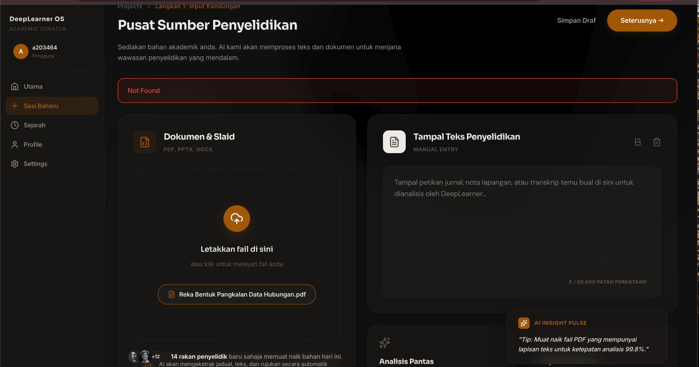
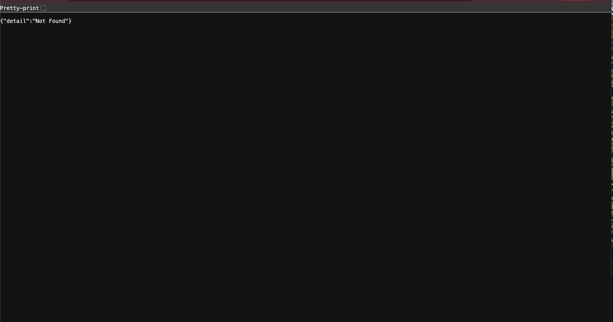

# DeepLearner OS 🎓

> **Sistem Pembelajaran Aktif Berkuasa AI** — FYP D5 A203464

An AI-powered active learning system that converts educational audio and PDF notes into clean transcripts, structured summaries, and higher-order MCQ quizzes — supporting both Bahasa Melayu and English.

---

## ✨ Features

| Feature | Description |
|---|---|
| 🎙️ Transcription | Audio → text via OpenAI Whisper, cleaned by local LLM (Ollama/Qwen) |
| 📄 PDF Extraction | Extracts text from PDFs using pdfplumber + PyMuPDF dual-strategy |
| ✨ Summarization | Structured Markdown summary (Pengenalan → Poin Utama → Kesimpulan) |
| ❓ Quiz Generation | Higher-order MCQ + True/False with per-question explanations |
| 🖼️ Multimodal Quiz | Quiz from image + text via Google Gemini 1.5 Flash |
| 📚 Sejarah Nota | Save, browse, and revisit past learning sessions |
| 📤 PDF Export | Export summary as PDF via jsPDF |

---

## 📁 Project Structure

```
DeepLearner_OS/
├── backend/
│   ├── main.py                     FastAPI entry point
│   ├── firebase_config.py          Firestore + Storage init
│   ├── requirements.txt
│   ├── .env                        API keys & model config
│   ├── serviceAccountKey.json      Firebase service account (do not commit)
│   ├── routers/
│   │   ├── transkripsi.py          POST /api/transcribe
│   │   ├── ringkasan.py            POST /api/summarize, GET /api/ringkasan/{id}
│   │   ├── kuiz.py                 POST /api/generate-quiz, /generate-quiz-multimodal
│   │   ├── nota.py                 GET/POST/DELETE /api/nota
│   │   └── dokumen.py              POST /api/extract-pdf
│   └── services/
│       ├── whisper_service.py      Whisper transcription
│       ├── transcript_cleaner.py   Ollama/Qwen transcript noise removal
│       ├── summarizer.py           4-tier summarization pipeline
│       ├── quiz_generator.py       3-tier MCQ generation + LLM explanation enrichment
│       ├── multimodal_quiz_generator.py  Gemini 1.5 Flash vision quiz
│       └── pdf_extractor.py        pdfplumber + PyMuPDF extraction
│
└── frontend/
    └── src/
        ├── firebase.js
        ├── App.jsx
        ├── index.css
        ├── pages/
        │   ├── Login.jsx
        │   ├── Register.jsx
        │   ├── Dashboard.jsx
        │   ├── AudioInput.jsx
        │   ├── Transcript.jsx
        │   ├── Summary.jsx
        │   ├── Quiz.jsx
        │   └── History.jsx
        └── components/
            └── Navbar.jsx
```

---

## 🛠️ Tech Stack

| Layer | Technology |
|---|---|
| Frontend | React 18 + Vite |
| Styling | Vanilla CSS (dark theme) |
| Backend | Python 3.10+ + FastAPI |
| Database | Firebase Firestore |
| Auth | Firebase Authentication |
| Storage | Firebase Storage |
| Transcription | OpenAI Whisper |
| Transcript Cleaning | Ollama / Qwen3:8b (local) |
| Summarization | OpenAI GPT-4o-mini → Ollama/Qwen → T5-small → Extractive |
| Quiz Generation | OpenAI GPT-4o-mini → Ollama/Qwen → NLP (spaCy) |
| Quiz Explanation | Ollama/Qwen enrichment → OpenAI fallback |
| Multimodal Quiz | Google Gemini 1.5 Flash |
| PDF Extraction | pdfplumber + PyMuPDF |
| PDF Export | jsPDF |

---

## 🤖 AI Pipeline Details

### Summarization (4-tier fallback)
1. **OpenAI GPT-4o-mini** — best quality, requires `OPENAI_API_KEY`
2. **Ollama/Qwen** (local) — good quality, requires Ollama running
3. **T5-small** — lightweight transformer, set `USE_AI_SUMMARIZER=true`
4. **Extractive** — always available, no API key needed

Output format: `## Ringkasan` → `**Pengenalan**` → `**Poin Utama**` → `**Kesimpulan**`

Noise filtering removes: timestamps, page markers, URLs, image alt-text, copyright notices, duplicate headings, slide fractions.

### Quiz Generation (3-tier fallback)
1. **OpenAI GPT-4o-mini** — Bloom's Taxonomy higher-order questions
2. **Ollama/Qwen** (local) — conceptual MCQ with explanations
3. **NLP (spaCy + heuristics)** — entity-aware distractors, smart True/False

NLP-generated questions are automatically enriched with LLM reasoning via a single batch call to Ollama (falls back to OpenAI, then keeps template).

Question types: Fill-in-the-blank · Conceptual identification · True/False (2 options only)

---

## 🚀 Setup Guide

### Step 1: Firebase Setup

1. Go to [Firebase Console](https://console.firebase.google.com) → Create project
2. Enable:
   - **Authentication** → Email/Password
   - **Firestore Database** → Start in test mode
   - **Storage** → Test mode
3. **Web App config** → Project Settings → General → Add app → Web → copy config
4. **Service Account Key** → Project Settings → Service accounts → Generate new private key → save as `backend/serviceAccountKey.json`

---

### Step 2: Configure Frontend Firebase

Edit `frontend/src/firebase.js`:

```js
const firebaseConfig = {
  apiKey: "YOUR_API_KEY",
  authDomain: "YOUR_PROJECT_ID.firebaseapp.com",
  projectId: "YOUR_PROJECT_ID",
  storageBucket: "YOUR_PROJECT_ID.appspot.com",
  messagingSenderId: "YOUR_SENDER_ID",
  appId: "YOUR_APP_ID"
};
```

---

### Step 3: Configure Backend Environment

```bash
cd backend
cp .env.example .env
```

Edit `.env`:

```env
OPENAI_API_KEY=sk-...          # Optional — enables GPT-4o-mini summarizer & quiz
GEMINI_API_KEY=...             # Optional — enables multimodal quiz (Gemini 1.5 Flash)
OLLAMA_HOST=http://localhost:11434
OLLAMA_MODEL=qwen3:8b          # Must match an installed Ollama model
USE_AI_SUMMARIZER=false        # Set true to use T5-small instead of Ollama
FIREBASE_STORAGE_BUCKET=your-project-id.appspot.com
```

---

### Step 4: Install Ollama (Recommended)

Ollama powers transcript cleaning, summarization fallback, quiz generation fallback, and explanation enrichment — all locally with no API cost.

```bash
# Install from https://ollama.com
ollama serve               # Start Ollama server
ollama pull qwen3:8b       # Download the model (~5GB)
```

---

### Step 5: Setup Backend

```bash
cd backend
python3 -m venv venv
source venv/bin/activate          # Windows: venv\Scripts\activate
pip install -r requirements.txt

# Optional — enhanced NLP distractor generation
pip install spacy && python -m spacy download en_core_web_sm

# Start the API server
uvicorn main:app --reload --reload-dir routers --reload-dir services
# API: http://localhost:8000
# Docs: http://localhost:8000/docs
```

> ⚠️ First run downloads Whisper model (~1.5 GB). Ollama must be running before starting the backend.

---

### Step 6: Run Frontend

```bash
cd frontend
npm install
npm run dev
# App: http://localhost:5173
```

---

## 🌐 Demo Sharing via Cloudflare Tunnel (FYP Presentation)

Run the app on your local machine and share it with anyone on the same network **or over the internet** using a free Cloudflare tunnel — no deployment, no server needed.

### How it works

The Vite dev server proxies all `/api` requests to the FastAPI backend (port 8000) internally, so only **one public URL** is needed. Anyone who opens the tunnel URL gets the full working app.

### One-time setup

```bash
brew install cloudflared
```

### Presentation startup (4 terminals)

```bash
# Terminal 1 — Local LLM
ollama serve

# Terminal 2 — Backend
cd backend && source venv/bin/activate && uvicorn main:app --reload --reload-dir routers --reload-dir services

# Terminal 3 — Frontend
cd frontend && npm run dev

# Terminal 4 — Public tunnel
cloudflared tunnel --url http://localhost:5173
```

`cloudflared` prints a free HTTPS URL, e.g.:

```
https://some-random-words.trycloudflare.com
```

Share this link — testers can open it on any phone or laptop without any extra setup.

> ⚠️ The tunnel URL resets every time you restart `cloudflared`. Restart it ~10 minutes before your presentation and share the new URL.

---

## 🧪 Usage Flow

1. **Register / Login** with your matric number
2. **Input Audio** → Upload `.wav` / `.mp3` → click **Jana Transkripsi**
3. **Transcript page** → Review cleaned transcript → click **Jana Ringkasan**
4. **Summary page** → Review structured summary → optionally **Simpan Nota** or **Eksport PDF**
5. Click **Jana Kuiz MCQ** → Answer questions with instant explanations
6. **Sejarah** → Browse all saved sessions and revisit summaries

---

## 🔑 Environment Variables Reference

| Variable | Required | Description |
|---|---|---|
| `OPENAI_API_KEY` | Optional | GPT-4o-mini for summarizer & quiz |
| `GEMINI_API_KEY` | Optional | Gemini 1.5 Flash for multimodal quiz |
| `OLLAMA_HOST` | Optional | Ollama server URL (default: `http://localhost:11434`) |
| `OLLAMA_MODEL` | Optional | Ollama model name (default: `qwen3:8b`) |
| `USE_AI_SUMMARIZER` | Optional | Set `true` to use T5-small (default: `false`) |
| `FIREBASE_STORAGE_BUCKET` | Required | Your Firebase Storage bucket |

---

## 📡 API Endpoints

| Method | Endpoint | Description |
|---|---|---|
| POST | `/api/transcribe` | Upload audio → transcription |
| POST | `/api/summarize` | Transcript ID → summary |
| GET | `/api/ringkasan/{id}` | Fetch saved summary |
| POST | `/api/generate-quiz` | Summary ID → MCQ quiz |
| POST | `/api/generate-quiz-multimodal` | Image/text → quiz (Gemini) |
| POST | `/api/extract-pdf` | PDF upload → extracted text |
| GET | `/api/nota/{noMatrik}` | List saved sessions |
| POST | `/api/nota` | Save a session |
| DELETE | `/api/nota/{idNota}` | Delete a session |

---

## ⚡ Startup Performance

### What was slow and why it was fixed

| Culprit | Cold cost | Fix applied |
|---|---|---|
| `spacy` + `torch` imported at module load in `quiz_generator.py` | **~3.7 s** | Made fully lazy — imported only when the NLP fallback is actually called |
| `@app.on_event("startup")` tried to load `en_core_web_sm` (not installed) | wasted attempt | Removed the startup hook entirely |
| `pdfplumber` + `PyMuPDF` imported at module level in `pdf_extractor.py` | **~0.7 s** | Moved imports inside `extract_text_from_pdf()` — free unless a PDF is uploaded |
| Vite forced `react`, `react-dom`, `axios`, `lucide-react` into prebundle | extra scan on cold start | Removed from `optimizeDeps.include` — Vite handles them fine on its own |
| Stale `.vite/deps 2/3/4/5` cache dirs (macOS rename duplicates) | cache thrash | Deleted |

**Expected result:** backend cold start drops from ~5 s → ~1 s; Vite cold start drops from ~20–30 s → ~5 s.

### Frontend — Node.js version and patches

The project requires **Node.js v22 via Homebrew**. Node v24 breaks ESM/CJS interop.

```bash
export PATH="/opt/homebrew/opt/node@22/bin:$PATH"
cd frontend && npm run dev
```

Two patches must survive every `npm install` (re-apply manually if broken):

**1. `node_modules/enhanced-resolve/esm-index.mjs`** — `createRequire` wrapper  
**2. `node_modules/postcss/lib/parse.js` lines 5-6** — unwrap `_Parser` namespace object

These fix lazy getter / CJS cache corruption bugs specific to Node 22 + Vite 6.

### Renaming the project directory (recommended)

The space in `DeepLearner_OS 2` is the root cause of the stale `deps 2/3/4/5` directories — macOS renames Vite's atomic cache swap when the path contains a space. Rename the directory to `DeepLearner_OS_v2` to prevent recurrence:

```bash
mv "DeepLearner_OS 2" DeepLearner_OS_v2
```

---

## 🔧 Troubleshooting

### "Failed to extract PDF" Error
If you encounter a "Failed to extract PDF" error when uploading a PDF file, it likely means the required local PDF parsing libraries are missing from your Python virtual environment.

**How to fix:**
1. Ensure your backend virtual environment is activated:
   ```bash
   cd backend
   source venv/bin/activate  # (On Windows: venv\Scripts\activate)
   ```
2. Install the necessary libraries:
   ```bash
   pip install pdfplumber pymupdf
   ```
   *(Note: These have already been added to requirements.txt, so `pip install -r requirements.txt` will also work in the future.)*
3. Restart your FastApi backend server:
   ```bash
   uvicorn main:app --reload --reload-dir routers --reload-dir services
   ```
4. **Scanned PDFs**: If you are trying to upload a scanned PDF (where pages are just images), make sure you have added your `GEMINI_API_KEY` to the `backend/.env` file. The backend will use Gemini Vision OCR as a fallback automatically.
